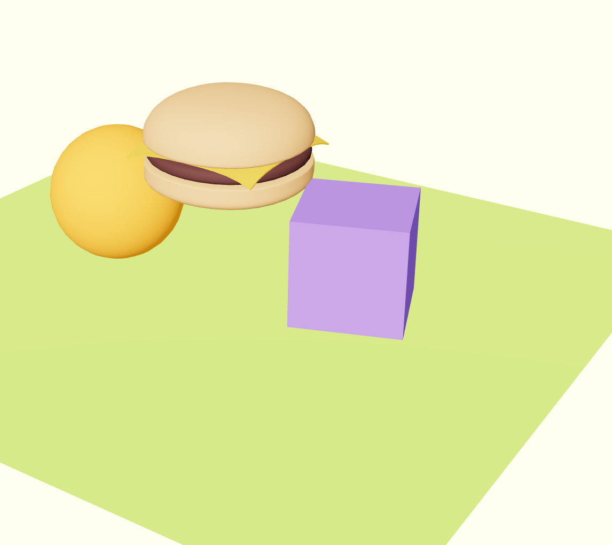
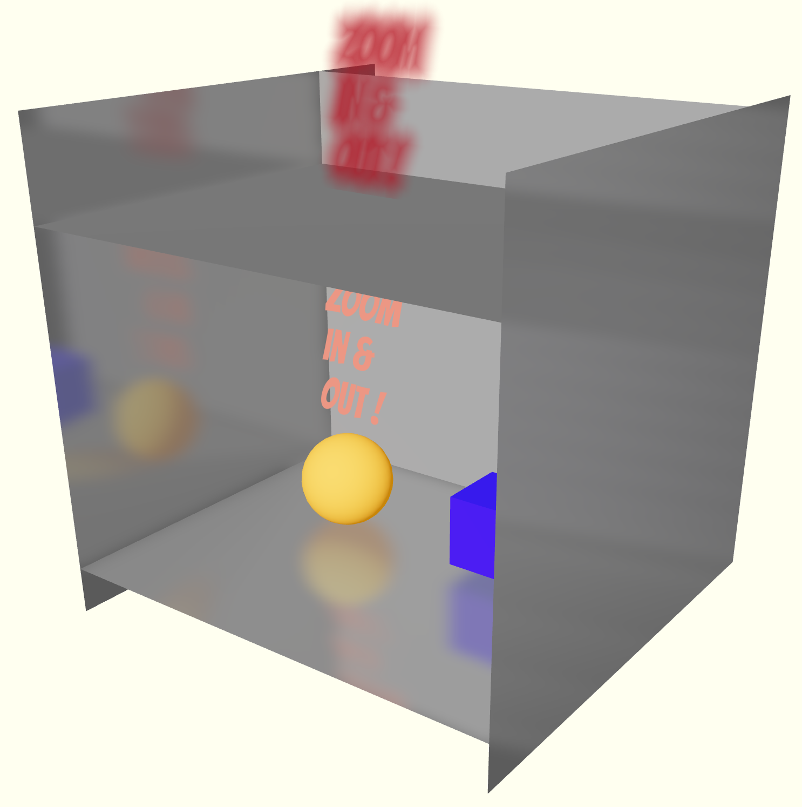

# r3f-snippets

- [Simple click handler to swap object positions](https://github.com/offgridauthor/r3f-snippets/tree/main/clickHandlerSwapPositions)

- [Floating text with doublesided reflective planes](https://github.com/offgridauthor/r3f-snippets/tree/main/text-w-doubleside-reflective-planes)

- [Rotating plane with gradient and Leva debug panel](https://github.com/offgridauthor/r3f-snippets/tree/main/rotating-plane-debug)

- [Golden icosahedron with stars inside](https://github.com/offgridauthor/r3f-snippets/tree/main/icosahedron-stars)

